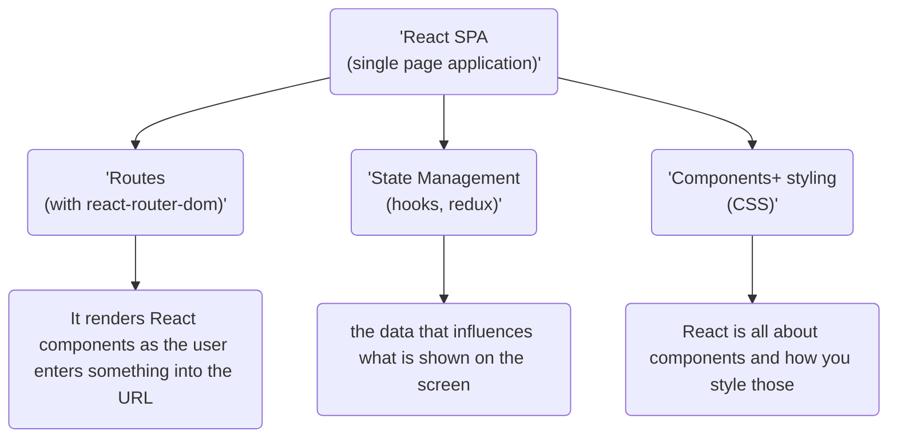
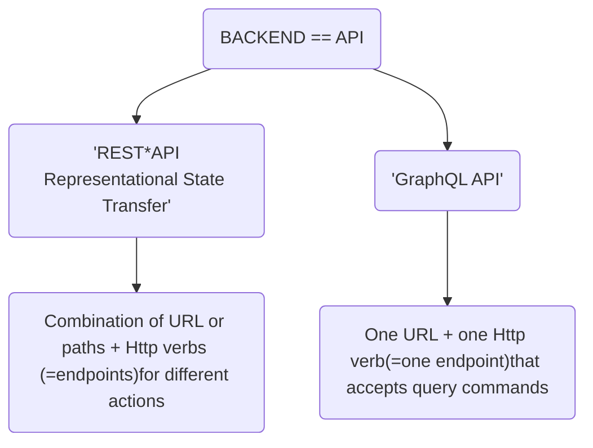

# The Frontend (Client)

## React SPA(single page application)

React is in charge of re-rendering everything in browser only one HTML page is surfed from some server to the browser, and there after react takes over. To handle that react will use an extra library -

# The backend (Server)

### API(application programming interface)

API function is to create entry points which means if someone built a library then for others to access it we need entry points so, that particular library can be used in their program this is where API comes into usage. In backend one makes a node express application which defines some entry points or the ways of communicating with it. API lets us control the entry points and users on react cannot by pass those entry points which is a good thing for security purposes. 

Both the API's store data, validate user input, get data from the database but the main difference is shown in the chart above.

#### REST vs GraphQL

 Rest API approach used this path HTTP method combination to identify resources of actions on a server which is very easy. REST api can also be used by any client based application which means if someone builds some mobile application with iOS one can use that same API. Which means this API is reusabe.

GraphQL uses query expression using a certain query language to identify a resource in action one can also attach any client to this API but in case of graphQL one has to learn the query language.

### Two Ways  of  Connecting Node + React

First way is to have both server side and the client side on the same machine i.e. setting up node react express and mongoDB on one machine

- Node (express) API handles incoming requests.
- Request that do not target API routes created by the user return to the react single page application.
- Data is exchanged between the react app and the node API in JSON format.

The other way is to have Two separate machines for front end and the backend. 

- Node(express) API handles incoming requests.
- React SPA served from separate static host.
- Data is exchanged between the react app and the node API in JSON format.

## Simple MERN application 

For basic idea there is an sample test MERN dummy application that has been run and tested

- To install node modules one has to use " npm install " in the place where the frontend code is installed as well as where the backend code is present separately.

- After installing, to start the server user has to type "npm start " in both frontend and the backend folders.

- when one starts the client side code it opens in the browser and shows some error those errors will automatically fixed when once the server side code is initiated using npm command (also to exit the server side code on terminal use "ctrl + c".)

  