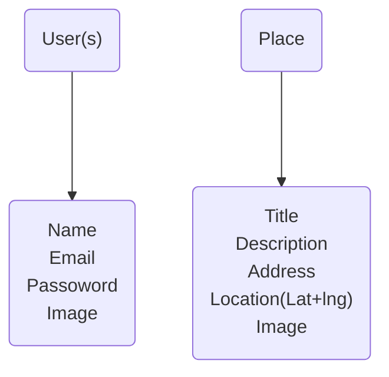

# DATABASE server

- Defining our mongoose models
- CRUD operations for place and user
- Connecting Places & users

The idea of database is to be fast and one should be able to execute the queries as quick as possible. Therefore one should not store the image in a database instead one can use url for that.

- Mongoose adds an ID getter to every document which returns the ID as a string.

### Relation between Users and places

- one place a can belong to exactly one user
- one user can create multiple places

in case of a big user data one can use unique keyword while declaring the type of an object this makes quering fast. 

- findOne finds one document matching the criteria in the argument of out method.