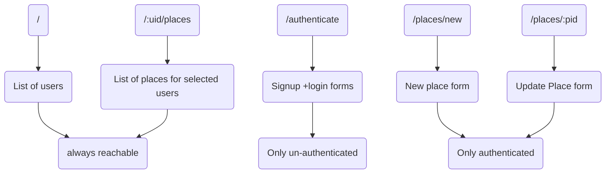

# Planning React/ MERN project

## General Planning Steps

1. Come up with an idea/ solving a problem
2. Creating a design/ sketch
3. Plan the data models(the data we'll work with)
4. Plan the endpoint (API, backend) and the pages (SPA, frontend)

### The Idea

Building an app where users can share places(with images & location) with other users.

- CRUD operations (create, read, update , delete) methods.

- Multiple data models, image upload, input validation.

- Authentication and authorization required - users will only be able to upload and when they create an id also in authorization we mean that only users that create some entry can update their entry not anyone who has logged in.

   

### Design/Sketch

This is the work for frontend the way we want the react application one can use a drawing tool to sketch a overview or also use a notebook for it. Now one must plan on how the main screen will look and what kind of details will be mentioned their also clicking which button will take us to other place for ex. clicking log in field one will go to the log in page and their one will find a form in which he can write his log in mail and so on also there will be a side button to create a new user.

### Application Data

 Users-

1. Name 
2. E-mail
3. password
4. Image

Place(s)-

1. Title
2. Description
3. Address
4. Location(Latitude + Longitude)
5. Image

Here point to keep in mind is that one user can create multiple places but one place belongs to exactly one user.

### API endpoints

Since we have 2 main data models we should have 2 main api endpoints

### For Users 

/api/users/...

###### GET .../

retrieve list of all users

###### POST.../signup

create new user + log user in

###### POST.../login

login user

------

### For Places

/api/places/...

###### GET.../user/:uid

retrieve list of all places for a given user id(uid)

###### GET.../:pid

get a specific place by place id(pid)

###### POST.../

create a new place

###### PATCH.../:pid

Update a place by id (pid)

###### DELETE.../:pid

delete a place by id (pid)

### SPA pages

