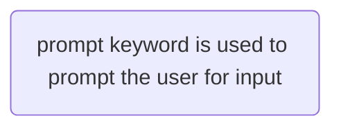
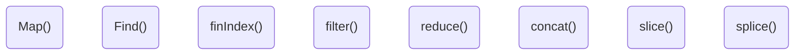

# JavaScript 

JavaScript is a dynamic typed language that is used to make web pages.

#### Export and Import function

export and import function is used for exporting some of the functions of any defined file to other file that one is working in so that function can be used in that file currently in use.

1. The first way to import and export files from javascript is:

   - To export any function or variables one can use

     ```javascript
     export let apikey="sakdaslkmd";
     ```

   - And to import this exported variable one can simply import it in the file where it is to be used

     ```javascript
     import { apikey } from './the name of the file along with the extention';
     console.log(apikey);
     ```

2. The other way to import and export is using default keyword:

   - Exporting using default one must not create a variable or assign a name (note- One must only have one default export per file.)

     ```javascript
     export default "sakdaslkmd"
     ```

   - Importing using default one has to import without curly braces, also one can assign any name of their choice.

     ```javascript
     import (any name of your choice without braces) from './the name of the file along with the extention';
     console.log(the name given above );
     ```

     this is a good way to export  or import a file if there is only one thing, one function or one value  to import or export.

3. If one has multiple named exports then-

   - one can simply group them as an object and export them 

     ```javascript
     export let apikey="sakdaslkmd";
     export let abc="abc";
     export let 123="123";
     ```

   - to import them one can use * and as keyword-

     ```javascript
     import * as (any name of your choice eg. util) from "./the name of the file along with the extention";
     console.log(util.apikey);
     console.log(util.abc);
     ```

     as keyword can also be used as making aliases for eg one variable from the export file is abc in import file one can write-

     ```javascript
     import{ apikey, abc as content } from './the name of the file along with the extention'
     console.log(content);
     ```

     

     ## Different types of  values

     ```mermaid
     flowchart TD;
     String(Text values)
     number(Positive of negative integer values)
     boolean( True or False)
     Null(Undefined and NULL values)
     objects(Special Objects)
     ```

     ### Functions

     Functions basic idea is that one writes a function which performs simple tast when called for eg squaring of a number this function is only used when its called also a function can also be called any number of times.

     To assign a function one simply writes 

     ```javascript
     function Square(a){
     return a*a;    
     }
     //and to call this function
     console.log(square(5))
     
     ```

     #### Arrow Functions 

     These are anonymous functions that don't need a name but one can store them in other variables and make them non-anonymous.

     these can be written like this

     ```javascript
     () =>{
         console.log('hello');
     }
     //alternatively these can also be defined like this
     function(){
     console.log("hello");
     }
     ```

     one can prefer any type of function its just a choice of preference some use arrow functions since they are quite short and makes code look better.

### Objects

An object contains values of that particular thing that object is for.. eg if the object name is Person then it would contain- his name, age, height, weight, etc...

To make an object -

```javascript
const user={
  name:"Achint",
    age: 22,
    weight:65,
    Hieght:5.11,
};
console.log(user);
//to get a particualar field one can use dot notation
console.log(user.age);
```

An object can also store functions which are then called methords

```javascript
const user={
    name:"Achint",
      square(a){
          return a*a;
      }
  };
  console.log(user.square(5));
```


### Arrays

Arrays are special kinds of objects just in case of arrays one can only create a list of values. Unlike objects they don't allow us to group values together they have just values which are stored in an order.

To make an array 

```javascript
const hobbies = ["sports", "cooking", "swimming"];
console.log(hobbies[0]);
//the index always starts at zero
```

arrays have in-built methods that can be used to modify delete or do several types of things to that array.

#### Destructuring Arrays

To pull values out of the array destructuring is used for example one need to pick out some of the contents of an array :

```javascript
const [firstname, lastname]= ["Achint","Katiyar"];
console.log(firstname);
//will give out put Achint

```

This destructuring can also be used for objects as well by using curly braces where we define an object.

note: in case of arrays one can use any name that we want during destructuring but in case of objects one must use the name of that particular object one needs to assign.

destructuring syntax can also be used for function parameters

```javascript
function storeOrder({id, currency}) { // destructuring
  localStorage.setItem('id', id);
  localStorage.setItem('currency', currency);
}
```

### Spread Operator(...)

spread operator is used to merge 2 or more arrays into one, now a user can also do this in 2 different ways:

1.  merging the array with another so that the new array consist of both elements of array 1 and 2.

   ```javascript
   const array1= ["sports", "cooking"];
   const array2= ["swimming"]
   const arraymerged= [...array1, ...array2];
   console.log(arraymerged);
   //the arraymerged will show the output consisting of all the 3 elements.
   ```

2. merging the array without the spread operator will result in an nested array which will consist of 2 arrays.

   ```javascript
   const array1= ["sports", "cooking"];
   const array2= ["swimming"]
   const arraymerged= [array1, array2];
   console.log(arraymerged);
   //the arraymerged will output 2 nested arrays in the output.
   ```

    

One can also use use the spread operator  similarly

```javascript
const user ={
    name:"Achint",
    age:23
};
const extendedUser = {
    isAdmin:true,
    ...user
};
console.log(extendedUser);
```

 




## Control Structures

### if/else Statements

These statements works the same ways how they do in any other programming language if the statement is compared and is true there will be an output else another outpur. One can also user "else if" if he wants to check for multiple paramerters.

### For Statements

For is used for looping something suppose there is an array and you need to write down each and every member of that array on your console for that you can simply

```javascript
const hobbies=["swimming", "dancing"];
for (const hobby of hobbies){
    console.log(hobby);
}
//this will output all the elements of the array hobbies.
```


## Using Functions as Values

To use functions as values one can use either the predefined functions or the functions created by user 

1. Using functions as values for built-in functions-

   ```javascript
   const timeout1= ()=>{
       console.log('timed out !');
   }
   const timeout2 = () =>{
       console.log("again timed out!"); 
   };
   setTimeout(timeout1, 2000);
   setTimeout(timeout2, 3000);
   //another way is to use arrow function which is more shorter 
   setTimeout(() =>{
       console.log("More timing out...");
   }, 4000);
   ```

2. Using functions as values for self made functions-

   ```javascript
   function greeter(greetings){
       greetings();
   }
   greeter(() => console.log("hi"));
   ```

## Defining Functions inside of functions

This is also called nesting of functions in this case a function is written inside of a function limits that functions usability in that function only i.e. it can't be called outside of that function.

```javascript
function init() {
    function greet(){
        console.log('Hi');
    }
   greet();
}
init();
//note that here hi will be console output but just cause greet function is being called into the init function if the greet was called out side the init function it won't work.
```

## Reference VS Primitive Value

- Primitive values can be defined as the values that can't be edited they can be overwritten tho these values are Strings,Booleans,numbers.

- Reference values are the values that can be edited by the user using methods for eg.

  ```javascript
  const hobbies =["sports", "dancing"];
  hobbies.push("working");
  console.log(hobbies);
  //now this array is updated or edited and hence objects and arrays are called reference type values.
  ```

  


## Some of the Important JS Array functions



