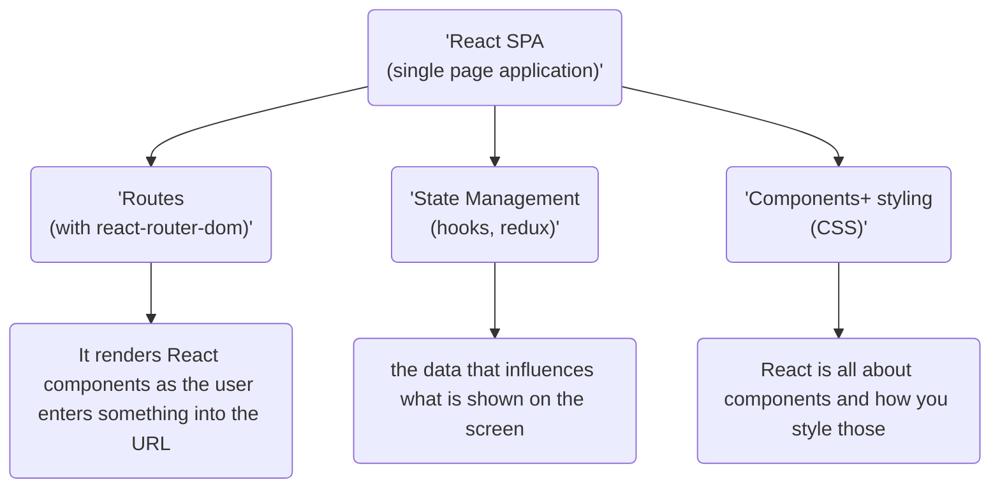
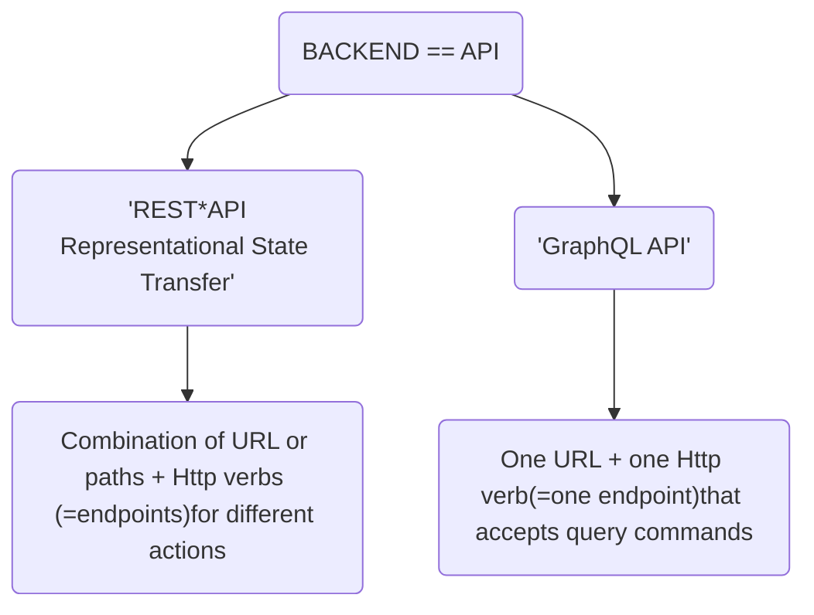

# MERN STACK

## Mongo DB 

Database Solution.

## Express

It's a framework for node js. and it makes building node.js applications easier.

## React

This is a javascript library that helps us build amazing user interfaces.

## Node js

Server-Side Javascript runtime, an environment where javascript code can be executed outside of the browser.

Combining these technologies form the MERN stack, they work particularly well and you can build amazing full stack web applications with these four technologies working together.

## What is React-

A client-side (browser) library which allows you to build highly reactive user interfaces. The user writes Javascript code that will be executed in the browser and since it runs there, it is responsible for what the users sees on the screen and how things there change when a button is clicked,when something is entered into an input box etc.

- Rendering UI with dynamic data and updating it when the data changes when certain events occur.
- Handling user input and providing feedback to the user 
- Communicating with backend services.

React is the front end and the other three (mongodb,express,nodjs.) together make up the backend. It's used to provide user a "mobile app"- like user experience where everything happens instantly, where we have a great reactivity, where things on the user interface really feel great and in standard provide a really awesome user experience.

## What is Node?

It's a javascript runtime typically used to create server side javascript applications. User can user node js to execute javascript outside of the browser and since it runs outside of the browser, one can use it to create web server with it, So to run it on some machine which is exposed to the internet which then accepts request and sends back responses, so we can then user JS as a server side programming language, as an alternative to PHP, ASP.net,..etc. With Node.js we can-

- Listen to requests and send responses

- Execute server-side logic

- Interact with Databases and files

  

Since we aren't tied to the browser one can't interact with the DOM(The Document Object Model is a cross-platform and language-independent interface that treats an HTML or XML document as a tree structure wherein each node is an object representing a part of the document. The DOM represents a document with a logical tree.), because there is no DOM, it's running outside the browser but there are new things one can do like write files. It's rarely used as a stand alone, typically we use it with express.

## What is Express?

A Node js. framework which simplifies writing server-side code and logic. We still write node js. javascript code but we get utility functions and a certain way of structuring and building our applications, so a certain ruleset we follow to which makes building node.js applications much easier.

- It's based on node.js but gives us new functionalities.
- It's strictly middleware based which means one have a clear way of handling requests, a clear funnel through which all requests are passed
- Includes routing, view-rendering etc.

there are variety of tools and clear rules that force us to write amazing and really well working nodejs. applications. Express really simplifies the usage of node.js.

## What is mongoDB ?

It's a NOSQL database engine which stores allows us to store documents in collections instead of records in tables as in SQL. It's a database engine its all about storing data-

- Store Application Data(users, products, etc.)
- Unlike SQL, it doesn't enforce a schema for our data. We can still build one and use one if we want to but we're not forced to and we also don't need to work with relations, we can still setup them but it's all a lot looser than it's in SQL.
- Databases like mongodb which are NOSQL databases often give you amazing performance because of their flexibility. 
- Easy to connet to node.js as writing queries against mongodb is really straightforward and super easy.

For security reasons users do not connect to MongoDB from inside our react application,Instead we do that with the help of node and express and that is how we then have all these technologies work together. It's a powerful database which can easily be integrated into a node express environment.

 

# MERN - The Big Picture

## Client (browser)

React.js is used to build our frontend facing web application. It's there to render something onto the screen and re-render it whenever something changes, update the UI and provide great user experience to our end users. React is responsible for what users see in the end.

#### Why is Reactjs not enough for website building-

 If we only work with react we have some limitations, most importantly we're not able to execute any logic on a server, so in a place where users can't see our code, they can see it in the browser, anyone can use the browser dev tool to look into our code and in addition to running code the user can't see or running more performance intensive task which we also don't want to do in the browser, in addition to that we typically also want to store some data in a persistent storage and the browser side is not such a persistent storage.

## Server side (backend)

This is web application that runs on a dedicated machine, a server, somewhere in the internet reachable by anyone, so opened up to incoming internet connections and that server is created and run with the help of node.js and a node framework express.js. These two pieces are used to write javascript code that runs on a server, detached from our client. There we can run any business logic, which we might want to hide from our users or which is more performance intensive since we run it on a dedicated machine, a dedicated server, we don't rely on the machine of our users.

### Connection between server side and client

The server side and the client side, communicate with requests and responses, Httprequests and responses, specifically called Ajax. These are triggered from client side javascript so that they are sent to the server and the response is handled in the client without reloading the page on the client, that is achieved by exchanging data which is not a HTML page which would be rendered by the browser and which would therefore lead to a page refresh but instead which is in a  JSON format.

## JSON

The client and the server communicate through requests and responses which are called http requests. All these communications take place in json(javascript object notation) data format. JSON is a machine readable and also quite human readable data format which in the end is used to exchange text data, numeric data and structured data in any form. This data is attached to both requests sent from the client to the server and responses received by the client, incoming from the server to then re-render something on the client side, using React to re-render the parts of the UI or to do something on the server side if the data's received there.

## Database Server

The database server acts as the third building block, this server can run on the same machine as our node server or completely different machine. The data base server in MongoDB is then used for the persistent data storage, not file storage, one should always store files on a system, not in a database but any other data, like the name of a product, the price of a product, the users of our web applications, things like that would be stored in a database.

### Communication between database server and node server-

Our node express application sends database queries using the MongoDB SDK or a MongoDB library, to that database server. We don't send requests from the client side directly to the database, because to send these queries, we need to include our database credentials, so the user name and password to log into our database.

# The Frontend (Client)

## React SPA(single page application)

React is in charge of re-rendering everything in browser only one HTML page is surfed from some server to the browser, and there after react takes over. To handle that react will use an extra library -

# The backend (Server)

### API(application programming interface)

API function is to create entry points which means if someone built a library then for others to access it we need entry points so, that particular library can be used in their program this is where API comes into usage. In backend one makes a node express application which defines some entry points or the ways of communicating with it. API lets us control the entry points and users on react cannot by pass those entry points which is a good thing for security purposes. 

Both the API's store data, validate user input, get data from the database but the main difference is shown in the chart above.

#### REST vs GraphQL

 Rest API approach used this path HTTP method combination to identify resources of actions on a server which is very easy. REST api can also be used by any client based application which means if someone builds some mobile application with iOS one can use that same API. Which means this API is reusabe.

GraphQL uses query expression using a certain query language to identify a resource in action one can also attach any client to this API but in case of graphQL one has to learn the query language.

### Two Ways  of  Connecting Node + React

First way is to have both server side and the client side on the same machine i.e. setting up node react express and mongoDB on one machine

- Node (express) API handles incoming requests.
- Request that do not target API routes created by the user return to the react single page application.
- Data is exchanged between the react app and the node API in JSON format.

The other way is to have Two separate machines for front end and the backend. 

- Node(express) API handles incoming requests.
- React SPA served from separate static host.
- Data is exchanged between the react app and the node API in JSON format.

## Simple MERN application 

For basic idea there is an sample test MERN dummy application that has been run and tested

- To install node modules one has to use " npm install " in the place where the frontend code is installed as well as where the backend code is present separately.

- After installing, to start the server user has to type "npm start " in both frontend and the backend folders.

- when one starts the client side code it opens in the browser and shows some error those errors will automatically fixed when once the server side code is initiated using npm command (also to exit the server side code on terminal use "ctrl + c".)

  
