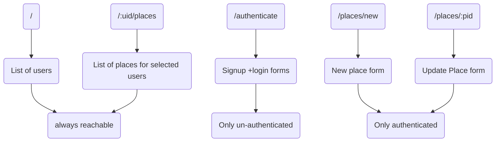

# Building a Standalone Frontend

## React-powered Frontend (SPA)

Creating React (single page) App with routing and core pages along with splitting into core components and in the last UI components + CSS styling.

## SPA pages

one cannot work on authentication right now cause that's consists of server side interaction with the spa application.

