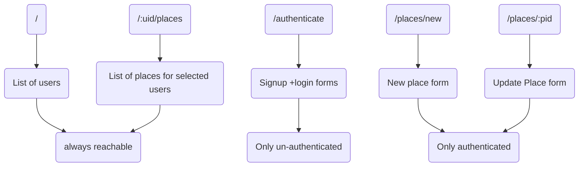

# Building a Standalone Frontend

## React-powered Frontend (SPA)

Creating React (single page) App with routing and core pages along with splitting into core components and in the last UI components + CSS styling.

## SPA pages

one cannot work on authentication right now cause that's consists of server side interaction with the spa application.

## Presentational  vs  Stateful Components-

- Presentational components are the components that are strictly used for styling and it will dumbly just process information that is provided to that component.

- Stateful components are used to present and also actively fetch data it wants to show from the backend server.

 

### Portals

It's a concept in the react that allows us to project or render a react component in a different place than it normally would be rendered.

### useRef

useref can be used to create references which can create references which can be one of two things, one use them to get a reference, a pointer at a real DOM node, also one can create variables which survive re-render cycles of our components and don't lose their value.

### useEffect 

It allows us to register logic, a function that should be executed when certain inputs change.

### useState()\

this allowed us to register state which then is managed inside of a component. When state is changed, the component re-renders (or to be precise: It is re-evaluated and might lead to a re-rendering of the DOM).

